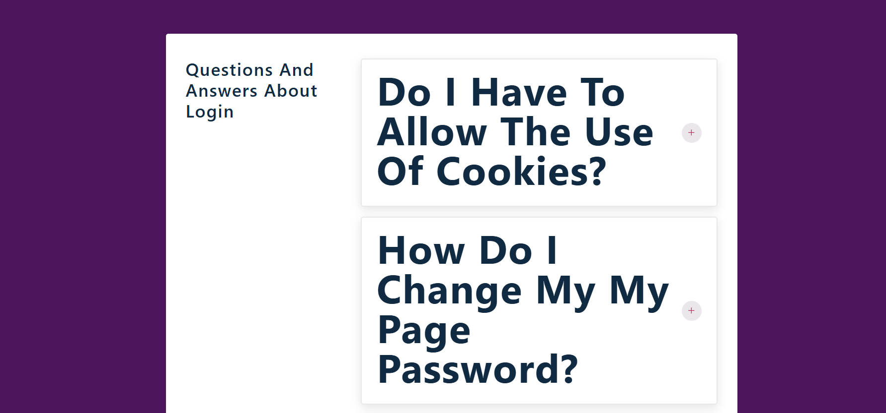

# accordion

it shows list of questions from the data file

it save the data using react useState hooks

and it map the questions and retrun  Qustion.js component
with the prop of question

with react-icon/ai have plus and minus button to show and hide the info

# page look like below image

@copyright Bisrat